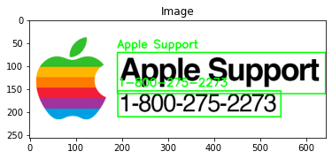
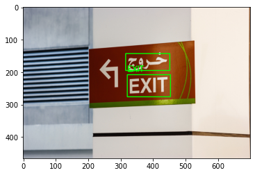

# Computer Vision - Optical Character Recognition (OCR) Exercise

## OCR on Text via Tesseract

### This is an exercise from PyImageSearch on [Using Tesseract OCT Python](https://pyimagesearch.com/2017/07/10/using-tesseract-ocr-python/) by Adrian Rosebrock

### Tesseract Installation

You can use this [link](https://github.com/UB-Mannheim/tesseract/wiki)


```python
## Uncomment the line below if you still need to install the pytesseract, opencv
#!pip install pytesseract
#!pip install opencv-contrib-python
```


```python
# import the necessary packages
import matplotlib.pyplot as plt
import pytesseract
import cv2
```


```python
def plt_imshow(title, image):
	# convert the image frame BGR to RGB color space and display it
	image = cv2.cvtColor(image, cv2.COLOR_BGR2RGB)
	plt.imshow(image)
	plt.title(title)
	plt.grid(False)
	plt.show()
```


```python
# construct the argument parser and parse the arguments
# ap = argparse.ArgumentParser()
# ap.add_argument("-i", "--image", required=True,
# 	help="path to input image to be OCR'd")
# ap.add_argument("-d", "--digits", type=int, default=1,
# 	help="whether or not *digits only* OCR will be performed")
# args = vars(ap.parse_args())

# since we are using Jupyter Notebooks we can replace our argument
# parsing code with *hard coded* arguments and values
args = {
	"image": "apple_support.png",
	"digits": 1,
}
```


```python
# load the input image, convert it from BGR to RGB channel ordering,
# and initialize our Tesseract OCR options as an empty string
image = cv2.imread(args["image"])
rgb = cv2.cvtColor(image, cv2.COLOR_BGR2RGB)
options = ""

# check to see if *digit only* OCR should be performed, and if so,
# update our Tesseract OCR options
if args["digits"] > 0:
    options = "outputbase digits"

# OCR the input image using Tesseract
#C:\Program Files\Tesseract-OCR
pytesseract.pytesseract.tesseract_cmd = r'C:\Program Files\Tesseract-OCR\tesseract.exe'
text = pytesseract.image_to_string(rgb, config=options)
print(text)
plt_imshow("Image", image)
```

    0
    1-800-275-2273
    
    


    

    


## OCR on Text via EasyOCR


```python
!pip install easyocr
```

    Requirement already satisfied: easyocr in c:\users\bamsa\appdata\roaming\python\python38\site-packages (1.4.1)
    Requirement already satisfied: scikit-image in c:\users\bamsa\anaconda3\lib\site-packages (from easyocr) (0.17.2)
    Requirement already satisfied: opencv-python-headless in c:\users\bamsa\appdata\roaming\python\python38\site-packages (from easyocr) (4.5.4.58)
    Requirement already satisfied: PyYAML in c:\users\bamsa\anaconda3\lib\site-packages (from easyocr) (5.3.1)
    Requirement already satisfied: numpy in c:\users\bamsa\appdata\roaming\python\python38\site-packages (from easyocr) (1.21.3)
    Requirement already satisfied: python-bidi in c:\users\bamsa\anaconda3\lib\site-packages (from easyocr) (0.4.2)
    Requirement already satisfied: torch in c:\users\bamsa\anaconda3\lib\site-packages (from easyocr) (1.10.0)
    Requirement already satisfied: scipy in c:\users\bamsa\anaconda3\lib\site-packages (from easyocr) (1.5.2)
    Requirement already satisfied: torchvision>=0.5 in c:\users\bamsa\anaconda3\lib\site-packages (from easyocr) (0.11.1)
    Requirement already satisfied: Pillow<8.3.0 in c:\users\bamsa\anaconda3\lib\site-packages (from easyocr) (8.0.1)
    Requirement already satisfied: matplotlib!=3.0.0,>=2.0.0 in c:\users\bamsa\anaconda3\lib\site-packages (from scikit-image->easyocr) (3.3.2)
    Requirement already satisfied: networkx>=2.0 in c:\users\bamsa\anaconda3\lib\site-packages (from scikit-image->easyocr) (2.5)
    Requirement already satisfied: imageio>=2.3.0 in c:\users\bamsa\anaconda3\lib\site-packages (from scikit-image->easyocr) (2.9.0)
    Requirement already satisfied: tifffile>=2019.7.26 in c:\users\bamsa\anaconda3\lib\site-packages (from scikit-image->easyocr) (2020.10.1)
    Requirement already satisfied: PyWavelets>=1.1.1 in c:\users\bamsa\anaconda3\lib\site-packages (from scikit-image->easyocr) (1.1.1)
    Requirement already satisfied: six in c:\users\bamsa\anaconda3\lib\site-packages (from python-bidi->easyocr) (1.15.0)
    Requirement already satisfied: typing-extensions in c:\users\bamsa\anaconda3\lib\site-packages (from torch->easyocr) (3.7.4.3)
    Requirement already satisfied: pyparsing!=2.0.4,!=2.1.2,!=2.1.6,>=2.0.3 in c:\users\bamsa\anaconda3\lib\site-packages (from matplotlib!=3.0.0,>=2.0.0->scikit-image->easyocr) (2.4.7)
    Requirement already satisfied: cycler>=0.10 in c:\users\bamsa\anaconda3\lib\site-packages (from matplotlib!=3.0.0,>=2.0.0->scikit-image->easyocr) (0.10.0)
    Requirement already satisfied: python-dateutil>=2.1 in c:\users\bamsa\anaconda3\lib\site-packages (from matplotlib!=3.0.0,>=2.0.0->scikit-image->easyocr) (2.8.1)
    Requirement already satisfied: certifi>=2020.06.20 in c:\users\bamsa\anaconda3\lib\site-packages (from matplotlib!=3.0.0,>=2.0.0->scikit-image->easyocr) (2020.6.20)
    Requirement already satisfied: kiwisolver>=1.0.1 in c:\users\bamsa\anaconda3\lib\site-packages (from matplotlib!=3.0.0,>=2.0.0->scikit-image->easyocr) (1.3.0)
    Requirement already satisfied: decorator>=4.3.0 in c:\users\bamsa\anaconda3\lib\site-packages (from networkx>=2.0->scikit-image->easyocr) (4.4.2)
    


```python
# import the necessary packages
from matplotlib import pyplot as plt
from easyocr import Reader
import argparse
import cv2
```


```python
def cleanup_text(text):
	# strip out non-ASCII text so we can draw the text on the image
	# using OpenCV
	return "".join([c if ord(c) < 128 else "" for c in text]).strip()
```


```python
# construct the argument parser and parse the arguments
#ap = argparse.ArgumentParser()
#ap.add_argument("-i", "--image", required=True,
#	help="path to input image to be OCR'd")
#ap.add_argument("-l", "--langs", type=str, default="en",
#	help="comma separated list of languages to OCR")
#ap.add_argument("-g", "--gpu", type=int, default=-1,
#	help="whether or not GPU should be used")
#args = vars(ap.parse_args())

# since we are using Jupyter Notebooks we can replace our argument
# parsing code with *hard coded* arguments and values
args = {
	"image": "images/arabic_sign.jpg",
	"langs": "en,ar",
	"gpu": 1
}
```


```python
%%time

# break the input languages into a comma separated list
langs = args["langs"].split(",")
print("[INFO] OCR'ing with the following languages: {}".format(langs))

# load the input image from disk
image = cv2.imread(args["image"])

# OCR the input image using EasyOCR
print("[INFO] OCR'ing input image...")
reader = Reader(langs, gpu=args["gpu"] > 0)
results = reader.readtext(image)
```

    CUDA not available - defaulting to CPU. Note: This module is much faster with a GPU.
    

    [INFO] OCR'ing with the following languages: ['en', 'ar']
    [INFO] OCR'ing input image...
    Wall time: 7.19 s
    


```python
# loop over the results
for (bbox, text, prob) in results:
	# display the OCR'd text and associated probability
	print("[INFO] {:.4f}: {}".format(prob, text))

	# unpack the bounding box
	(tl, tr, br, bl) = bbox
	tl = (int(tl[0]), int(tl[1]))
	tr = (int(tr[0]), int(tr[1]))
	br = (int(br[0]), int(br[1]))
	bl = (int(bl[0]), int(bl[1]))

	# cleanup the text and draw the box surrounding the text along
	# with the OCR'd text itself
	text = cleanup_text(text)
	cv2.rectangle(image, tl, br, (0, 255, 0), 2)
	cv2.putText(image, text, (tl[0], tl[1] - 10),
		cv2.FONT_HERSHEY_SIMPLEX, 0.8, (0, 255, 0), 2)
```

    [INFO] 0.9994: EXIT
    [INFO] 0.9831: خروج
    


```python
# show the output image
plt.imshow(image)
```


    <matplotlib.image.AxesImage at 0x217cca2b220>


    

    


```python
import glob

reader = Reader(langs, gpu=args["gpu"] > 0)

import os
root = './images'
for file in os.listdir("./images"):
    if file.endswith(".jpg"):
        # load the input image from disk
        image = cv2.imread(os.path.join(root,file))

        # OCR the input image using EasyOCR
        print("[INFO] OCR'ing input image..." + file)
        results = reader.readtext(image)
        
        # loop over the results
        for (bbox, text, prob) in results:
            # display the OCR'd text and associated probability
            print("[INFO] {:.4f}: {}".format(prob, text))

            # unpack the bounding box
            (tl, tr, br, bl) = bbox
            tl = (int(tl[0]), int(tl[1]))
            tr = (int(tr[0]), int(tr[1]))
            br = (int(br[0]), int(br[1]))
            bl = (int(bl[0]), int(bl[1]))

            # cleanup the text and draw the box surrounding the text along
            # with the OCR'd text itself
            text = cleanup_text(text)
            cv2.rectangle(image, tl, br, (0, 255, 0), 2)
            cv2.putText(image, text, (tl[0], tl[1] - 10),
                cv2.FONT_HERSHEY_SIMPLEX, 0.8, (0, 255, 0), 2)
            
        cv2.imwrite('./results/'+file, image)
        plt.imshow(image)
```

    CUDA not available - defaulting to CPU. Note: This module is much faster with a GPU.
    

    [INFO] OCR'ing input image...170px-ReceiptSwiss.jpg
    [INFO] 0.0240: &rosi 9haidnsg
    [INFO] 0.0132: !47/.{#0/0!;1011|
    [INFO] 0.0155: 1 ٦ ٢١،
    [INFO] 0.0044: ٧1٤0
    [INFO] 0.0010: اا ما ٣
    [INFO] OCR'ing input image...AcclaimedCV1.jpg
    [INFO] 0.4905: KA
    [INFO] 0.9994: KEVIN
    [INFO] 0.9739: ANDERSON
    [INFO] 0.6856: Kundersongemoil com
    [INFO] 0.9992: 123-555-1234
    [INFO] 0.6464: 123 Purk Avenue Eig Rupids, MI 68965
    [INFO] 0.8543: PROFESSIONAL
    [INFO] 0.2584: Highly umbi-ious Accountoni with obockground in soles, muering ond
    [INFO] 0.9993: SUMMARY
    [INFO] 0.3602: odverfising  Epertise in morket onolysis, forecosiing ond client needs
    [INFO] 0.3300: ossessments,
    [INFO] 0.4320: WORK HISTORY
    [INFO] 0.8402: Accounling Monager
    [INFO] 0.5102: ٨٤ 
    [INFO] 0.5343: Accouniing
    [INFO] 0.1799: 819
    [INFO] 0.9995: 11/2018
    [INFO] 0.6559: CURREVT
    [INFO] 0.4638: Rupios, Michigen
    [INFO] 0.3790: Supporled Chief Operoting Officer with doily operolionol functions.
    [INFO] 0.2364: Reseorched ond updoled ollrequired motenols needed for firrn
    [INFO] 0.4268: ond poriners
    [INFO] 0.9984: SKILLS
    [INFO] 0.9116: Powerful negotiolor
    [INFO] 0.5807: Communicotion skils
    [INFO] 0.4848: Strong verbal comnmunicolion
    [INFO] 0.6044: Microsoft Office
    [INFO] 0.3365: Teomn lioison
    [INFO] 0.6316: Client ussessment und onolysis
    [INFO] 0.6437: Budgeling und finonce
    [INFO] 0.8452: Scheduling
    [INFO] 0.5252: EDUCAIION
    [INFO] 0.6533: Universily Of Michigan Lorsing
    [INFO] 0.9997: 2018
    [INFO] 0.3210: Master of Business Adminishalion' EconOIics
    [INFO] 0.9340: ACCOMPLISHME
    [INFO] 0.5468: Compuler Proficiency -
    [INFO] 0.6532: Used Mlicrosofl Ecel to develop inventory
    [INFO] 0.6455: NIS
    [INFO] 0.4233: Irocking spreudsheets
    [INFO] 0.6668: Effeclive Communicotion -
    [INFO] 0.3881: Followed up und kept Irock of
    [INFO] 0.5125: expecled orders from Ihe court ond correspondence from
    [INFO] 0.4549: opposing ollomneys
    [INFO] 0.2581: SUervIsIOn 
    [INFO] 0.4924: Supervised teom of Ihree stoff members
    [INFO] 0.5171: 50|45
    [INFO] 0.4149: Increosed sules by 62% over 
    [INFO] 0.3346: ٢٥ vecr
    [INFO] 0.4683: period.
    [INFO] 0.4778: Creclive Problem Solving:
    [INFO] 0.6508: Resolved product issue through
    [INFO] 0.4272: consumer tesring
    [INFO] 0.7225: CERTIFICATIONS
    [INFO] 0.2527: Member Insntule of Logislics und Tonspor [MILT|
    [INFO] 0.4741: CMA |Cerlified Monogement Accountontl confered by Instilule
    [INFO] 0.2793: Of Monugement AccountonIs (IMAJ
    [INFO] 0.4845: Cerliffed Protection Officer [CPO|
    [INFO] OCR'ing input image...arabic_sign.jpg
    [INFO] 0.9994: EXIT
    [INFO] 0.9831: خروج
    [INFO] OCR'ing input image...receipt (1).jpg
    [INFO] 1.0000: STRONG
    [INFO] 0.6813: FLOUR
    [INFO] 0.9834: EAST
    [INFO] 0.4171: c0^501~01
    [INFO] 0.9307: SINGA
    [INFO] 0.5866: T٤٦
    [INFO] 0.5491: POR E
    [INFO] 0.1260: 53875-
    [INFO] 0.5493: 6440
    [INFO] 0.9929: Receipt No
    [INFO] 0.7137: 00011677_
    [INFO] 0.9713: Table
    [INFO] 0.9496: 13
    [INFO] 0.2938: Pashi
    [INFO] 0.6690: imeغ
    [INFO] 0.9984: 05-05-18
    [INFO] 0.7851: GRANCHIO
    [INFO] 0.6252: VONGOLE
    [INFO] 0.9461: ARUGULA PESTO
    [INFO] 0.8038: FOC
    [INFO] 0.9388: PIZZA
    [INFO] 0.8950: ORTOLANA
    [INFO] 0.4635: FC
    [INFO] 0.9896: LATTE
    [INFO] 0.7952: THE   ENTERTAINER
    [INFO] 0.6181: Sub-Total
    [INFO] 0.9999: 45
    [INFO] 0.2382: 5.05
    [INFO] 1.0000: 7%
    [INFO] 0.8555: GST
    [INFO] 0.6480: 13: 33
    [INFO] 0.8489: TOTAL
    [INFO] 0.9249: 48. 15
    [INFO] 0.9994: VISA
    [INFO] 0.9132: 48. 15
    [INFO] 0.5944: SERVICF  CHARGE
    [INFO] 0.0725: R0AD
    [INFO] 0.8017: KATONG
    [INFO] 0.2254: 13: 31
    [INFO] 0.2243: A٥ni
    [INFO] OCR'ing input image...receipt.jpg
    [INFO] 0.4967: Iite
    [INFO] 0.6146: Castle
    [INFO] 0.5445: Ihite Castle #010O29
    [INFO] 0.9902: Sale
    [INFO] 0.9170: # 143710882
    [INFO] 0.3412: Team Mlember #8B4
    [INFO] 0.6146: Ja٨ 31
    [INFO] 0.9997: 2017
    [INFO] 0.5151: Tuesday 12:43:53 ٥I
    [INFO] 0.4134: **+ Drive thru *xx
    [INFO] 0.9999: Register
    [INFO] 0.5648: PACK 9
    [INFO] 0.6682: Fack 9 Disc
    [INFO] 0.9965: -2.47
    [INFO] 0.3995: 20 CBR
    [INFO] 0.4946: 18. 60
    [INFO] 0.5990: 4 $ ٤٤
    [INFO] 0.6472: 6.76
    [INFO] 0.2272: 2 FISF CH
    [INFO] 0.9976: 3.18
    [INFO] 0.4910: 2 CKN CH
    [INFO] 0.9378: 3.38
    [INFO] 0.5436: SINIIR DISC
    [INFO] 0.3187: SENIDR DISCOUNT
    [INFO] 0.9311: -2.95
    [INFO] 0.9726: Tax
    [INFO] 0.9236: 2.65
    [INFO] 0.6305: Grand Total
    [INFO] 0.9556: 29.15
    [INFO] 0.4338: Crecit Card
    [INFO] 0.5625: 29,15
    [INFO] 0.6723: Vou Savec
    [INFO] 0.9974: 5.42
    [INFO] OCR'ing input image...swedish_sign.jpg
    [INFO] 0.9978: Fartkontrol
    [INFO] OCR'ing input image...turkish_sign.jpg
    [INFO] 0.7166: ٥UR
    


```python

```
